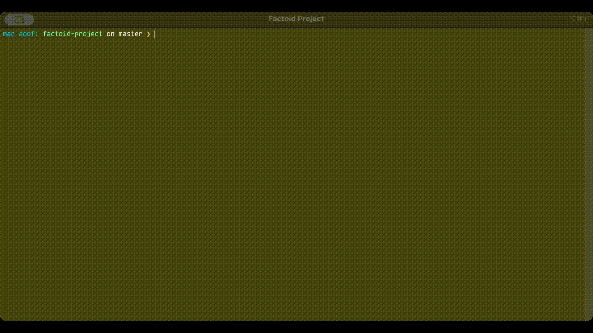

# FactoidProject



## Installation

1. **Clone the repository:**
   ```sh
   git clone https://github.com/Aoof/factoid-project.git
   cd factoid-project
   ```

2. **Build the project:**
   ```sh
   dotnet build
   ```

3. **Run the project:**
   ```sh
   dotnet run
   ```

## Overview

> **Note:** The pseudocode is only to help us understand the code better and be able to explain it concisely. **The professor follows different pseudocode conventions, so we should not use this pseudocode in the final report.**

FactoidProject is a console application designed to analyze and answer questions based on the data provided by the user. The application processes the input data, identifies the type of question, and attempts to find the best possible answer from the data.

Altered version of pseudocodes to help explain it concisely are provided for the main components of the application, including the main method, question processing, data retrieval, answer extraction, similarity calculation, and user interface components.

## Main Components

### 1. Main Method
The entry point of the application. It sets up the console, prompts the user for data, and enters a loop to process user questions until the user decides to exit.
```csharp
void Main(string[] args)
```
**Pseudocode:**
```
Set console title and clear console
Show welcome message
Prompt user for data
If data is provided, store it; otherwise, use placeholder data
Enter main loop:
    Get user input
    If input is "exit", break loop
    If input is "guide", show guide
    If input is "data", show data
    Otherwise, process the question
    Prompt user to continue
    Reset bubbles
```

### 2. ProcessQuestion Method
Analyzes the user's question, determines the type of question, retrieves relevant data, and calculates the similarity between the question and the data to find the best possible answer. It also displays the question, answer, and similarity percentage in a styled format.
```csharp
void ProcessQuestion(string input)
```
**Pseudocode:**
```
Determine question type
Retrieve data sentences
Initialize variables for max similarity and best sentence
For each sentence:
    Remove stop words
    Calculate similarity with input
    Sum similarities
    Get answers based on question type
    If similarity is highest and answers are valid, update max similarity and best sentence
Calculate lexical match percentage
Get best answers from best sentence
If no valid answers, set default answer
Show question, answer, and similarity percentage in styled format
```

### 3. GetAnswers Method
Determines the type of answer to extract based on the question type (e.g., person, place, date, number) and retrieves the relevant answers from the given sentence. It uses helper methods to extract specific types of information.
```csharp
string[] GetAnswers(string sentence, string questionType)
```
**Pseudocode:**
```
Split sentence into words and trim whitespace
Join words back into a sentence
Switch based on question type:
    If "PERSON", call GetPeople
    If "PLACE", call GetPlaces
    If "DATE", call GetDates
    If "NUMBER", call GetNumbers
    Otherwise, return default answer
Return answers
```

### 4. RetrieveData Method
Processes the input data by splitting it into sentences and cleaning up unnecessary characters. This method ensures that the data is in a suitable format for analysis.
```csharp
string[] RetrieveData(string input)
```
**Pseudocode:**
```
Replace newlines with spaces in data
Replace "Inc." with "Inc"
Split data into sentences based on punctuation
Trim and clean up each sentence
Return sentences
```

### 5. RemoveStopWords Method
Removes common stop words from a given string to improve the accuracy of the similarity calculation. This method helps in focusing on the meaningful words in the sentences.
```csharp
string RemoveStopWords(string str)
```
**Pseudocode:**
```
Define list of stop words
Split input string into words
For each word:
    If word is a stop word, remove it
Join remaining words into a string
Return cleaned string
```

### 6. GetPeople, GetPlaces, GetDates, GetNumbers Methods
Each method extracts specific types of information (people, places, dates, numbers) from a given sentence. These methods are used by the `GetAnswers` method to find relevant answers based on the question type.
```csharp
string[] GetPeople(string sentence)
string[] GetPlaces(string sentence)
string[] GetDates(string sentence)
string[] GetNumbers(string sentence)
```
**Pseudocode for GetPeople:**
```
Split sentence into words
Initialize list for people
For each word:
    If word starts with an uppercase letter, add to people list
Return list of people
```

**Pseudocode for GetPlaces:**
```
Split sentence into words
Initialize list for places
For each word:
    If word is uppercase, add to places list
Return list of places
```

**Pseudocode for GetDates:**
```
Split sentence into words
Initialize list for dates
For each word:
    If word contains date format or is a valid year, add to dates list
Return list of dates
```

**Pseudocode for GetNumbers:**
```
Split sentence into words
Initialize list for numbers
For each word:
    If word contains number format, add to numbers list
Return list of numbers
```

### 7. GetSimilarity Method
Calculates the similarity between the user's question and a given sentence from the data. This method helps in identifying the most relevant sentence that matches the user's question.
```csharp
double GetSimilarity(string input, string sentence)
```
**Pseudocode:**
```
Split input and sentence into words
Initialize similarity counter
For each word in input:
    For each word in sentence:
        If words match, increment similarity counter
Calculate similarity as ratio of matches to minimum length of input and sentence
Return similarity
```

### 8. GetQuestionType Method
Identifies the type of question based on specific keywords (e.g., who, where, when, how many, how much). This method helps in determining the type of answer to extract.
```csharp
string GetQuestionType(string input)
```
**Pseudocode:**
```
Convert input to lowercase
Define list of keywords and corresponding question types
For each keyword:
    If input contains keyword, return corresponding question type
Return "UNKNOWN" if no match found
```

### 9. ShowData Method
Displays the current data and allows the user to enter new data. This method provides an interface for the user to manage the data being analyzed.
```csharp
void ShowData()
```
**Pseudocode:**
```
Clear console
Show data information in styled format
Prompt user to enter new data
If new data is provided, update data
```

### 10. ShowGuide Method
Displays a guide explaining how to use the application and the special commands available. This method helps users understand the functionality and usage of the application.
```csharp
void ShowGuide()
```
**Pseudocode:**
```
Clear console
Show program guide in styled format
Show special commands in styled format
```

### 11. ShowBubble Method
Displays messages in a styled "bubble" format on the console. This method enhances the user interface by presenting information in a visually appealing way.
```csharp
void ShowBubble(string text, ConsoleColor color = ConsoleColor.DarkGreen)
```
**Pseudocode:**
```
Store message in bubbles array
Calculate box dimensions based on console width
Set console color
Draw top border of bubble
Split text into lines
For each line:
    Draw line within bubble
Draw bottom border of bubble
Reset console color
```

### 12. CommandString Method
Formats command descriptions for display in the guide and input prompt. This method helps in presenting the commands in a consistent and readable format.
```csharp
string CommandString(string command, string description)
```
**Pseudocode:**
```
Format command and description into a single string
Return formatted string
```

### 13. GetInput Method
Displays the main input prompt to the user, including the title, student names, special commands, and captures the user's input. This method provides an interface for the user to interact with the application.
```csharp
string GetInput(string prompt = "Enter your question: ")
```
**Pseudocode:**
```
Clear console
Define sections and commands
Set console color
Calculate box dimensions based on console width
Draw top border of input box
Draw title, student names, and special commands within box
Draw prompt within box
Draw bottom border of input box
Reset console color
Set cursor position for input
Read user input
Return user input
```

## Special Commands

- `exit` - Exit the program
- `guide` - Show the guide of the program
- `data` - Show the data you have entered

## Example Usage

1. **Enter Data:**
   ```
   Enter your data:
   The history of programming languages spans from documentation of early mechanical computers to modern tools for software development. Early programming languages were highly specialized, relying on mathematical notation and similarly obscure syntax. Throughout the 20th century, research in compiler theory led to the creation of high-level programming languages, which use a more accessible syntax to communicate instructions. The first high-level programming language was created by Konrad Zuse in 1943. The first high-level language to have an associated compiler was created by Corrado Böhm in 1951. Konrad Zuse was born on 1910/06/22, in GERMANY, and was a notable civil engineer, pioneering computer scientist, inventor, and businessman.
   ```

2. **Ask Questions:**
   ```
   Enter your question: Who created the first high-level programming language?
   ```

3. **View Answer:**
   ```
   Konrad Zuse 
   ```

4. **Ask More Questions:**
   ```
   Enter your question: When was Konrad Zuse born?
   ```

5. **View Answer:**
   ```
   1910/06/22
   ```


## Conclusion
This is a small study project that demonstrates the implementation of a factoid question-answering system using C#. The application processes user questions, retrieves relevant data, calculates similarity, and extracts answers based on the question type. The pseudocode provides a high-level overview of the main components and methods used in the application. The user interface components enhance the user experience by presenting information in a visually appealing and structured format. The special commands allow users to manage data, view guides, and exit the program easily. Overall, the application showcases the basic functionality of a factoid question-answering system and serves as a foundation for further development and enhancements.